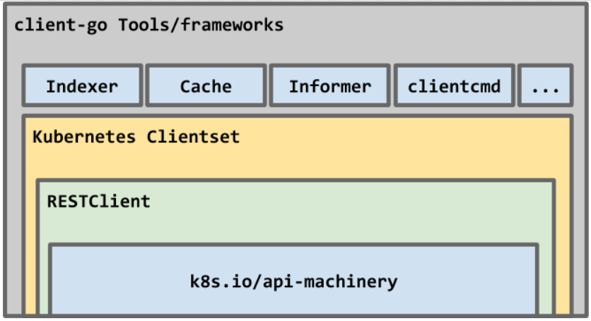

# code-generator로 Kubernetes CRD 핸들링 하기

## code-generator란?

[kubernetes/code-generator](https://github.com/kubernetes/code-generator)
- in the context of **CustomResourceDefinition** to build native, versioned clients, informers and other helpers
- in the context of **User-provider API Servers** to build conversions between internal and versioned types, defaulters, protobuf codecs, internal and versioned clients and informers.

- `// +<tag_name>[=value]` 형태의 주석들을 살펴볼 수 있는데 이것들은 **code generator**을 위한 주석


## CR(Custom Resource) 정의 및 생성

> CRD 명명규칙 : {plural-resource-name}.{api-group-name}

[crd.yaml]
```yaml
apiVersion: "apiextensions.k8s.io/v1beta1"
kind: "CustomResourceDefinition"
metadata:
  name: "mypods.ilsa.example.com"
spec:
  group: "ilsa.example.com"
  version: "v1"
  scope: "Namespaced"
  names:
    plural: "mypods"
    singular: "mypod"
    kind: "MyPod"
  validation:
    openAPIV3Schema:
      required: ["spec"]
      properties:
        spec:
          required: ["replicas"]
          properties:
            replicas:
              type: "integer"
              minimum: 1
```

[mypod.yaml]

```yaml
apiVersion: "ilsa.example.com/v1"
kind: "MyPod"
metadata:
  name: "mypod-ilsa"
  namespace: "ilsa"
spec:
  replicas: 1
```


## Go 프로젝트 초기 셋팅

```
$ go mod init github.com/jungmin17/ilsa-clientset-example
go: creating new go.mod: module github.com/jungmin17/ilsa-clientset-example
```

```
$ go get k8s.io/client-go@v0.21.0
$ go get k8s.io/apimachinery@v0.21.0
```


[go.mod]
```
module github.com/jungmin17/ilsa-clientset-example

go 1.15

require (
	k8s.io/apimachinery v0.21.0 // indirect
	k8s.io/client-go v0.21.0 // indirect
)
```


/pkg/apis/{group}/{version} 경로 생성

```
.
├── README.md
├── go.mod
├── go.sum
└── pkg
    └── apis
		└── ilsa
			└── v1
```


## /pkg/ilsa/v1/doc.go

> v1 패키지에 속한 모든 타입들에 대해 deep copy 함수가 생성될 것이고 Kuberetes API group명은 ilsa.example.com이 될 것이다.

```go
// +k8s:deepcopy-gen=package
// +k8s:defaulter-gen=TypeMeta
// +groupName=ilsa.example.com
// +groupGoName=Ilsa

package v1

const GroupName = "ilsa.example.com"
const GroupVersion = "v1"
```

## /pkg/ilsa/v1/types.go

CRD 구조 정의!

> +genclient: 현재 패키지에 정의된 자료 구조에 대해서 Kubernetes Client를 생성하라. 사용자는 해당 client를 통해 Kubernetes와 커뮤니케이션할 수 있다.

> +k8s:deepcopy-gen:interfaces=k8s.io/apimachinery/pkg/runtime.Object: 다음 코드에 대해서 [Deep Copy](https://greenmon.dev/2018/11/27/object-copy.html) 로직을 생성하라.


```go
package v1

import metav1 "k8s.io/apimachinery/pkg/apis/meta/v1"

type MyPodSpec struct {
	Replicas int `json:"replicas"`
}

// +genclient
// +k8s:deepcopy-gen:interfaces=k8s.io/apimachinery/pkg/runtime.Object
type MyPod struct {
	metav1.TypeMeta   `json:",inline"`
	metav1.ObjectMeta `json:"metadata,omitempty"`

	Spec MyPodSpec `json:"spec"`
}

// +k8s:deepcopy-gen:interfaces=k8s.io/apimachinery/pkg/runtime.Object
type MyPodList struct {
	metav1.TypeMeta `json:",inline"`
	metav1.ListMeta `json:"metadata,omitempty"`

	Items []MyPod `json:"items"`
}
```


- [metav1.ObjectMeta](https://github.com/kubernetes/apimachinery/blob/ed135c5b96450fd24e5e981c708114fbbd950697/pkg/apis/meta/v1/types.go#L93)
```go
type ObjectMeta struct {
	Name string `json:"name,omitempty" protobuf:"bytes,1,opt,name=name"`
	GenerateName string `json:"generateName,omitempty" protobuf:"bytes,2,opt,name=generateName"`
	Namespace string `json:"namespace,omitempty" protobuf:"bytes,3,opt,name=namespace"`
	SelfLink string `json:"selfLink,omitempty" protobuf:"bytes,4,opt,name=selfLink"`
	UID types.UID `json:"uid,omitempty" protobuf:"bytes,5,opt,name=uid,casttype=k8s.io/kubernetes/pkg/types.UID"`
	ResourceVersion string `json:"resourceVersion,omitempty" protobuf:"bytes,6,opt,name=resourceVersion"`
	Generation int64 `json:"generation,omitempty" protobuf:"varint,7,opt,name=generation"`
	CreationTimestamp Time `json:"creationTimestamp,omitempty" protobuf:"bytes,8,opt,name=creationTimestamp"`
	DeletionTimestamp *Time `json:"deletionTimestamp,omitempty" protobuf:"bytes,9,opt,name=deletionTimestamp"`
	DeletionGracePeriodSeconds *int64 `json:"deletionGracePeriodSeconds,omitempty" protobuf:"varint,10,opt,name=deletionGracePeriodSeconds"`
	Labels map[string]string `json:"labels,omitempty" protobuf:"bytes,11,rep,name=labels"`
	Annotations map[string]string `json:"annotations,omitempty" protobuf:"bytes,12,rep,name=annotations"`
	OwnerReferences []OwnerReference `json:"ownerReferences,omitempty" patchStrategy:"merge" patchMergeKey:"uid" protobuf:"bytes,13,rep,name=ownerReferences"`
	Initializers *Initializers `json:"initializers,omitempty" protobuf:"bytes,16,opt,name=initializers"`
	Finalizers []string `json:"finalizers,omitempty" patchStrategy:"merge" protobuf:"bytes,14,rep,name=finalizers"`
	ClusterName string `json:"clusterName,omitempty" protobuf:"bytes,15,opt,name=clusterName"`
}
```
- [metav1.TypeMeta](https://github.com/kubernetes/apimachinery/blob/ed135c5b96450fd24e5e981c708114fbbd950697/pkg/runtime/types.go#L36)

```go
type TypeMeta struct {
    APIVersion string `json:"apiVersion,omitempty" yaml:"apiVersion,omitempty"`
    Kind string `json:"kind,omitempty" yaml:"kind,omitempty"`
}
```


## /pkg/ilsa/v1/register.go

> CRD client가 우리가 새롭게 정의한 타입에 대해서 알기 위해서는 schema를 등록해줘야 한다. 이를 이용하여 code generator가 CRD client 코드를 생성하게 된다.

```go
package v1

import (
	metav1 "k8s.io/apimachinery/pkg/apis/meta/v1"
	"k8s.io/apimachinery/pkg/runtime"
	"k8s.io/apimachinery/pkg/runtime/schema"
)


var SchemeGroupVersion = schema.GroupVersion{Group: GroupName, Version: GroupVersion}
var objects = []runtime.Object{
	&MyPod{},
	&MyPodList{},
}

var (
	SchemeBuilder = runtime.NewSchemeBuilder(addKnownTypes)
	AddToScheme   = SchemeBuilder.AddToScheme
)

func addKnownTypes(scheme *runtime.Scheme) error {
	scheme.AddKnownTypes(SchemeGroupVersion, objects...)
	metav1.AddToGroupVersion(scheme, SchemeGroupVersion)
	return nil
}
```

여기까지해서 code generator가 코드를 생성하는데 필요한 **boilerplate code**들을 모두 작성하였다.

> 컴퓨터 프로그래밍에서 보일러플레이트 또는 보일러플레이트 코드라고 부르는 것은 최소한의 변경으로 여러곳에서 재사용되며, 반복적으로 비슷한 형태를 띄는 코드

## /pkg/ilsa/v1/zz_generated.deepcopy.go


[Is it possible to install only controller-gen library?](https://github.com/kubernetes-sigs/controller-tools/issues/520)  
[controller-gen 버전 정보](https://github.com/kubernetes-sigs/controller-tools/releases)

```
$ export GOPATH=$HOME/go
$ export GO111MODULE=on
$ go get sigs.k8s.io/controller-tools/cmd/controller-gen@v0.5.0
```

```
controller-gen object paths=./pkg/apis/ilsa/v1/types.go
```

```
.
├── README.md
├── crd.yaml
├── go.mod
├── go.sum
├── mypod.yaml
└── pkg
    ├── apis
		└── ilsa
			└── v1
				├── doc.go
				├── register.go
				├── types.go
				└── zz_generated.deepcopy.go
```

```go
package v1

import (
	runtime "k8s.io/apimachinery/pkg/runtime"
)

// DeepCopyInto is an generated deepcopy function, copying the receiver, writing into out. in must be non-nil.
func (in *MyPod) DeepCopyInto(out *MyPod) {
	*out = *in
	out.TypeMeta = in.TypeMeta
	in.ObjectMeta.DeepCopyInto(&out.ObjectMeta)
	out.Spec = in.Spec
	return
}

// DeepCopy is an generated deepcopy function, copying the receiver, creating a new MyPod.
func (in *MyPod) DeepCopy() *MyPod {
	if in == nil {
		return nil
	}
	out := new(MyPod)
	in.DeepCopyInto(out)
	return out
}

// DeepCopyObject is an generated deepcopy function, copying the receiver, creating a new runtime.Object.
func (in *MyPod) DeepCopyObject() runtime.Object {
	if c := in.DeepCopy(); c != nil {
		return c
	}
	return nil
}

// DeepCopyInto is an generated deepcopy function, copying the receiver, writing into out. in must be non-nil.
func (in *MyPodList) DeepCopyInto(out *MyPodList) {
	*out = *in
	out.TypeMeta = in.TypeMeta
	in.ListMeta.DeepCopyInto(&out.ListMeta)
	if in.Items != nil {
		in, out := &in.Items, &out.Items
		*out = make([]MyPod, len(*in))
		for i := range *in {
			(*in)[i].DeepCopyInto(&(*out)[i])
		}
	}
	return
}

// DeepCopy is an generated deepcopy function, copying the receiver, creating a new MyPodList.
func (in *MyPodList) DeepCopy() *MyPodList {
	if in == nil {
		return nil
	}
	out := new(MyPodList)
	in.DeepCopyInto(out)
	return out
}

// DeepCopyObject is an generated deepcopy function, copying the receiver, creating a new runtime.Object.
func (in *MyPodList) DeepCopyObject() runtime.Object {
	if c := in.DeepCopy(); c != nil {
		return c
	}
	return nil
}

// DeepCopyInto is an generated deepcopy function, copying the receiver, writing into out. in must be non-nil.
func (in *MyPodSpec) DeepCopyInto(out *MyPodSpec) {
	*out = *in
	return
}

// DeepCopy is an generated deepcopy function, copying the receiver, creating a new MyPodSpec.
func (in *MyPodSpec) DeepCopy() *MyPodSpec {
	if in == nil {
		return nil
	}
	out := new(MyPodSpec)
	in.DeepCopyInto(out)
	return out
}
```

## code generator 실행

경로를 제대로 맞춰주지 않으면 generate-groups.sh 실행시 다음과 같은 오류가 발생한다.

```
Failed loading boilerplate: open $HOME/go/src/k8s.io/code-generator/hack/boilerplate.go.txt: no such file or directory
```

```
$ cd $GOPATH/src/k8s.io
$ git clone https://github.com/kubernetes/code-generator.git
```

```
$ $GOPATH/src/k8s.io/code-generator/generate-groups.sh all \
github.com/jungmin17/ilsa-clientset-example/pkg/client \
github.com/jungmin17/ilsa-clientset-example/pkg/apis \
"Ilsa:v1"

Generating deepcopy funcs
Generating clientset for Ilsa:v1 at github.com/jungmin17/ilsa-clientset-example/pkg/client/clientset
Generating listers for Ilsa:v1 at github.com/jungmin17/ilsa-clientset-example/pkg/client/listers
Generating informers for Ilsa:v1 at github.com/jungmin17/ilsa-clientset-example/pkg/client/informers
```

명령어 사용법

```
Usage: $(basename "$0") <generators> <output-package> <apis-package> <groups-versions> ...
  <generators>        the generators comma separated to run (deepcopy,defaulter,client,lister,informer) or "all".
  <output-package>    the output package name (e.g. github.com/example/project/pkg/generated).
  <apis-package>      the external types dir (e.g. github.com/example/api or github.com/example/project/pkg/apis).
  <groups-versions>   the groups and their versions in the format "groupA:v1,v2 groupB:v1 groupC:v2", relative
                      to <api-package>.
  ...                 arbitrary flags passed to all generator binaries.
```

(before)
```
.
├── README.md
├── crd.yaml
├── go.mod
├── go.sum
├── mypod.yaml
└── pkg
    ├── apis
		└── ilsa
			└── v1
				├── doc.go
				├── register.go
				├── types.go
				└── zz_generated.deepcopy.go
```
(after)
```
.
├── README.md
├── crd.yaml
├── go.mod
├── go.sum
├── main.go
├── mypod.yaml
└── pkg
    ├── apis
    │   └── ilsa
    │       └── v1
    │           ├── doc.go
    │           ├── register.go
    │           ├── types.go
    │           └── zz_generated.deepcopy.go
    └── client
        ├── clientset
        │   └── versioned
        │       ├── clientset.go
        │       ├── doc.go
        │       ├── fake
        │       │   ├── clientset_generated.go
        │       │   ├── doc.go
        │       │   └── register.go
        │       ├── scheme
        │       │   ├── doc.go
        │       │   └── register.go
        │       └── typed
        │           └── ilsa
        ├── informers
        │   └── externalversions
        │       ├── Ilsa
        │       │   ├── interface.go
        │       │   └── v1
        │       ├── factory.go
        │       ├── generic.go
        │       └── internalinterfaces
        │           └── factory_interfaces.go
        └── listers
            └── ilsa
                └── v1
                    ├── expansion_generated.go
                    └── mypod.go
```

<p align="center">
  
</p>

## pkg/client/clientset/versioned/typed/ilsa/v1/mypod.go


- MyPodInterface를 통해 MyPod kind에 대한 CRUD 구현
  - Create
  - Update
  - Delete
  - DeleteCollection
  - Get
  - List
  - Watch
  - Patch
- newMyPods를 통해 MyPod object에 대한 rest client 생성

> kubernetes clientset과 비교했을 때 Namespaces()과 동일 계층

clientset, err := kubernetes.NewForConfig(config)  
clientset.CoreV1().**Namespaces()**.List(context.TODO(), metav1.ListOptions{})

```go
package v1

import (
	"context"
	"time"

	v1 "github.com/jungmin17/ilsa-clientset-example/pkg/apis/Ilsa/v1"
	scheme "github.com/jungmin17/ilsa-clientset-example/pkg/client/clientset/versioned/scheme"
	metav1 "k8s.io/apimachinery/pkg/apis/meta/v1"
	types "k8s.io/apimachinery/pkg/types"
	watch "k8s.io/apimachinery/pkg/watch"
	rest "k8s.io/client-go/rest"
)

// MyPodsGetter has a method to return a MyPodInterface.
// A group's client should implement this interface.
type MyPodsGetter interface {
	MyPods(namespace string) MyPodInterface
}

// MyPodInterface has methods to work with MyPod resources.
type MyPodInterface interface {
	Create(ctx context.Context, myPod *v1.MyPod, opts metav1.CreateOptions) (*v1.MyPod, error)
	Update(ctx context.Context, myPod *v1.MyPod, opts metav1.UpdateOptions) (*v1.MyPod, error)
	Delete(ctx context.Context, name string, opts metav1.DeleteOptions) error
	DeleteCollection(ctx context.Context, opts metav1.DeleteOptions, listOpts metav1.ListOptions) error
	Get(ctx context.Context, name string, opts metav1.GetOptions) (*v1.MyPod, error)
	List(ctx context.Context, opts metav1.ListOptions) (*v1.MyPodList, error)
	Watch(ctx context.Context, opts metav1.ListOptions) (watch.Interface, error)
	Patch(ctx context.Context, name string, pt types.PatchType, data []byte, opts metav1.PatchOptions, subresources ...string) (result *v1.MyPod, err error)
	MyPodExpansion
}

// myPods implements MyPodInterface
type myPods struct {
	client rest.Interface
	ns     string
}

// newMyPods returns a MyPods
func newMyPods(c *IlsaV1Client, namespace string) *myPods {
	return &myPods{
		client: c.RESTClient(),
		ns:     namespace,
	}
}

// Get takes name of the myPod, and returns the corresponding myPod object, and an error if there is any.
func (c *myPods) Get(ctx context.Context, name string, options metav1.GetOptions) (result *v1.MyPod, err error) {
	result = &v1.MyPod{}
	err = c.client.Get().
		Namespace(c.ns).
		Resource("mypods").
		Name(name).
		VersionedParams(&options, scheme.ParameterCodec).
		Do(ctx).
		Into(result)
	return
}

// List takes label and field selectors, and returns the list of MyPods that match those selectors.
func (c *myPods) List(ctx context.Context, opts metav1.ListOptions) (result *v1.MyPodList, err error) {
	var timeout time.Duration
	if opts.TimeoutSeconds != nil {
		timeout = time.Duration(*opts.TimeoutSeconds) * time.Second
	}
	result = &v1.MyPodList{}
	err = c.client.Get().
		Namespace(c.ns).
		Resource("mypods").
		VersionedParams(&opts, scheme.ParameterCodec).
		Timeout(timeout).
		Do(ctx).
		Into(result)
	return
}

// Watch returns a watch.Interface that watches the requested myPods.
func (c *myPods) Watch(ctx context.Context, opts metav1.ListOptions) (watch.Interface, error) {
	var timeout time.Duration
	if opts.TimeoutSeconds != nil {
		timeout = time.Duration(*opts.TimeoutSeconds) * time.Second
	}
	opts.Watch = true
	return c.client.Get().
		Namespace(c.ns).
		Resource("mypods").
		VersionedParams(&opts, scheme.ParameterCodec).
		Timeout(timeout).
		Watch(ctx)
}

// Create takes the representation of a myPod and creates it.  Returns the server's representation of the myPod, and an error, if there is any.
func (c *myPods) Create(ctx context.Context, myPod *v1.MyPod, opts metav1.CreateOptions) (result *v1.MyPod, err error) {
	result = &v1.MyPod{}
	err = c.client.Post().
		Namespace(c.ns).
		Resource("mypods").
		VersionedParams(&opts, scheme.ParameterCodec).
		Body(myPod).
		Do(ctx).
		Into(result)
	return
}

// Update takes the representation of a myPod and updates it. Returns the server's representation of the myPod, and an error, if there is any.
func (c *myPods) Update(ctx context.Context, myPod *v1.MyPod, opts metav1.UpdateOptions) (result *v1.MyPod, err error) {
	result = &v1.MyPod{}
	err = c.client.Put().
		Namespace(c.ns).
		Resource("mypods").
		Name(myPod.Name).
		VersionedParams(&opts, scheme.ParameterCodec).
		Body(myPod).
		Do(ctx).
		Into(result)
	return
}

// Delete takes name of the myPod and deletes it. Returns an error if one occurs.
func (c *myPods) Delete(ctx context.Context, name string, opts metav1.DeleteOptions) error {
	return c.client.Delete().
		Namespace(c.ns).
		Resource("mypods").
		Name(name).
		Body(&opts).
		Do(ctx).
		Error()
}

// DeleteCollection deletes a collection of objects.
func (c *myPods) DeleteCollection(ctx context.Context, opts metav1.DeleteOptions, listOpts metav1.ListOptions) error {
	var timeout time.Duration
	if listOpts.TimeoutSeconds != nil {
		timeout = time.Duration(*listOpts.TimeoutSeconds) * time.Second
	}
	return c.client.Delete().
		Namespace(c.ns).
		Resource("mypods").
		VersionedParams(&listOpts, scheme.ParameterCodec).
		Timeout(timeout).
		Body(&opts).
		Do(ctx).
		Error()
}

// Patch applies the patch and returns the patched myPod.
func (c *myPods) Patch(ctx context.Context, name string, pt types.PatchType, data []byte, opts metav1.PatchOptions, subresources ...string) (result *v1.MyPod, err error) {
	result = &v1.MyPod{}
	err = c.client.Patch(pt).
		Namespace(c.ns).
		Resource("mypods").
		Name(name).
		SubResource(subresources...).
		VersionedParams(&opts, scheme.ParameterCodec).
		Body(data).
		Do(ctx).
		Into(result)
	return
}
```

## pkg/client/clientset/versioned/typed/ilsa/v1/ilsa_client.go

- ilsa/v1(group/version)에 대한 rest client 생성

> kubernetes clientset과 비교했을 때 CoreV1()과 동일 계층

clientset, err := kubernetes.NewForConfig(config)  
clientset.**CoreV1()**.Namespaces().List(context.TODO(), metav1.ListOptions{})


```go
package v1

import (
	v1 "github.com/jungmin17/ilsa-clientset-example/pkg/apis/Ilsa/v1"
	"github.com/jungmin17/ilsa-clientset-example/pkg/client/clientset/versioned/scheme"
	rest "k8s.io/client-go/rest"
)

type IlsaV1Interface interface {
	RESTClient() rest.Interface
	MyPodsGetter
}

// IlsaV1Client is used to interact with features provided by the ilsa.example.com group.
type IlsaV1Client struct {
	restClient rest.Interface
}

func (c *IlsaV1Client) MyPods(namespace string) MyPodInterface {
	return newMyPods(c, namespace)
}

// NewForConfig creates a new IlsaV1Client for the given config.
func NewForConfig(c *rest.Config) (*IlsaV1Client, error) {
	config := *c
	if err := setConfigDefaults(&config); err != nil {
		return nil, err
	}
	client, err := rest.RESTClientFor(&config)
	if err != nil {
		return nil, err
	}
	return &IlsaV1Client{client}, nil
}

// NewForConfigOrDie creates a new IlsaV1Client for the given config and
// panics if there is an error in the config.
func NewForConfigOrDie(c *rest.Config) *IlsaV1Client {
	client, err := NewForConfig(c)
	if err != nil {
		panic(err)
	}
	return client
}

// New creates a new IlsaV1Client for the given RESTClient.
func New(c rest.Interface) *IlsaV1Client {
	return &IlsaV1Client{c}
}

func setConfigDefaults(config *rest.Config) error {
	gv := v1.SchemeGroupVersion
	config.GroupVersion = &gv
	config.APIPath = "/apis"
	config.NegotiatedSerializer = scheme.Codecs.WithoutConversion()

	if config.UserAgent == "" {
		config.UserAgent = rest.DefaultKubernetesUserAgent()
	}

	return nil
}

// RESTClient returns a RESTClient that is used to communicate
// with API server by this client implementation.
func (c *IlsaV1Client) RESTClient() rest.Interface {
	if c == nil {
		return nil
	}
	return c.restClient
}
```

## pkg/client/clientset/versioned/clientset.go

-  여러 API 그룹, 버전 및 리소스를 포함한 clientset

```go
package versioned

import (
	"fmt"

	ilsav1 "github.com/jungmin17/ilsa-clientset-example/pkg/client/clientset/versioned/typed/ilsa/v1"
	discovery "k8s.io/client-go/discovery"
	rest "k8s.io/client-go/rest"
	flowcontrol "k8s.io/client-go/util/flowcontrol"
)

type Interface interface {
	Discovery() discovery.DiscoveryInterface
	IlsaV1() ilsav1.IlsaV1Interface
}

// Clientset contains the clients for groups. Each group has exactly one
// version included in a Clientset.
type Clientset struct {
	*discovery.DiscoveryClient
	ilsaV1 *ilsav1.IlsaV1Client
}

// IlsaV1 retrieves the IlsaV1Client
func (c *Clientset) IlsaV1() ilsav1.IlsaV1Interface {
	return c.ilsaV1
}

// Discovery retrieves the DiscoveryClient
func (c *Clientset) Discovery() discovery.DiscoveryInterface {
	if c == nil {
		return nil
	}
	return c.DiscoveryClient
}

// NewForConfig creates a new Clientset for the given config.
// If config's RateLimiter is not set and QPS and Burst are acceptable,
// NewForConfig will generate a rate-limiter in configShallowCopy.
func NewForConfig(c *rest.Config) (*Clientset, error) {
	configShallowCopy := *c
	if configShallowCopy.RateLimiter == nil && configShallowCopy.QPS > 0 {
		if configShallowCopy.Burst <= 0 {
			return nil, fmt.Errorf("burst is required to be greater than 0 when RateLimiter is not set and QPS is set to greater than 0")
		}
		configShallowCopy.RateLimiter = flowcontrol.NewTokenBucketRateLimiter(configShallowCopy.QPS, configShallowCopy.Burst)
	}
	var cs Clientset
	var err error
	cs.ilsaV1, err = ilsav1.NewForConfig(&configShallowCopy)
	if err != nil {
		return nil, err
	}

	cs.DiscoveryClient, err = discovery.NewDiscoveryClientForConfig(&configShallowCopy)
	if err != nil {
		return nil, err
	}
	return &cs, nil
}

// NewForConfigOrDie creates a new Clientset for the given config and
// panics if there is an error in the config.
func NewForConfigOrDie(c *rest.Config) *Clientset {
	var cs Clientset
	cs.ilsaV1 = ilsav1.NewForConfigOrDie(c)

	cs.DiscoveryClient = discovery.NewDiscoveryClientForConfigOrDie(c)
	return &cs
}

// New creates a new Clientset for the given RESTClient.
func New(c rest.Interface) *Clientset {
	var cs Clientset
	cs.ilsaV1 = ilsav1.New(c)

	cs.DiscoveryClient = discovery.NewDiscoveryClient(c)
	return &cs
}
```

## main.go

- crd의 clientset을 import하여 mypod list 출력

```go
package main

import (
	"context"
	"flag"
	"fmt"
	metav1 "k8s.io/apimachinery/pkg/apis/meta/v1"
	"k8s.io/client-go/kubernetes"
	"k8s.io/client-go/tools/clientcmd"
	"k8s.io/client-go/util/homedir"
	"path/filepath"
	ilsaclient "github.com/jungmin17/ilsa-clientset-example/pkg/client/clientset/versioned"
)

func main() {
	var kubeconfig *string
	if home := homedir.HomeDir(); home != "" {
		kubeconfig = flag.String("kubeconfig", filepath.Join(home, ".kube", "config"), "(optional) absolute path to the kubeconfig file")
	} else {
		kubeconfig = flag.String("kubeconfig", "", "absolute path to the kubeconfig file")
	}
	flag.Parse()


	// use the current context in kubeconfig
	config, err := clientcmd.BuildConfigFromFlags("", *kubeconfig)
	if err != nil {
		panic(err.Error())
	}

	//k8s client setting
	clientset, err := kubernetes.NewForConfig(config)
	if err != nil {
		panic(err.Error())
	}

	ilsaClientset, err := ilsaclient.NewForConfig(config)
	if err != nil {
		panic(err.Error())
	}

	//something....
	namespaceList, err := clientset.CoreV1().Namespaces().List(context.TODO(), metav1.ListOptions{})
	if err != nil {
		panic(err.Error())
	}
	for _, item := range namespaceList.Items {
		ilsas, err := ilsaClientset.IlsaV1().MyPods(item.Name).List(context.TODO(), metav1.ListOptions{})
		if err != nil {
			panic(err.Error())
		}
		for _, ilsa := range ilsas.Items {
			fmt.Println("namespace :", item.Name)
			fmt.Println("name :", ilsa.Name)
			fmt.Println("replica :",ilsa.Spec.Replicas)
		}

	}
	fmt.Println("------")
}
```

```
// 실행 전 필요한 모듈을 모두 가져옴
$ go get -u

$ go run main.go
namespace : ilsa
name : mypod-ilsa
replica : 1
------
```

## 참고

[How to generate client codes for Kubernetes Custom Resource Definitions (CRD)](https://itnext.io/how-to-generate-client-codes-for-kubernetes-custom-resource-definitions-crd-b4b9907769ba)  
[Kubernetes Controller 구현해보기](https://getoutsidedoor.com/2020/05/09/kubernetes-controller-%EA%B5%AC%ED%98%84%ED%95%B4%EB%B3%B4%EA%B8%B0/)  
[Kubernetes Deep Dive: Code Generation for CustomResources](https://www.openshift.com/blog/kubernetes-deep-dive-code-generation-customresources)   
[Accessing Kubernetes CRDs from the client-go package](https://www.martin-helmich.de/en/blog/kubernetes-crd-client.html)